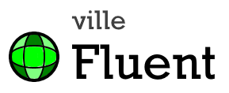

<!-- PROJECT LOGO -->
<br />
<p align="center">
  <a href="https://github.com/sqville/ville.Fluent">
    
  </a>

  <h3 align="center"></h3>

  <p align="center">
    A theme for the Qooxdoo JavaScript Framework
  </p>
</p>

<!-- ABOUT THE PROJECT -->
## About The Project

**ville.Fluent** is a [Qooxdoo](https://qooxdoo.org/) theme inspired by [Microsofts Fluent UI](https://developer.microsoft.com/en-us/fluentui#/). Fluent UI Qooxdoo

**Additional Benefits**
* Adheres to Fluent UI design principles
* Uses color schemes and theme designer
* Web font and SVG based icons

**Form Controls**


<!-- GETTING STARTED -->
## Using the Theme in your Application
To use the Theme in your application, go into the application root directory and install the theme into your project:
```sh
$ qx package update
$ qx package list
$ qx package install sqville/ville.Fluent
```
now you just have to modify your compile.json to enable the theme:
```sh
"applications": [
  {
    ...
    "theme": "ville.theme.Fluent",
    ...
  }
],
```

<!-- DEMOS -->
## Demo
Using Qooxdoos [WidgetBrowser](http://qooxdoo.org/qxl.packagebrowser/qxl.packagebrowser/demos/sqville/ville.Fluent/widgetbrowser/)

<!-- ROADMAP -->
## Roadmap

TBD


<!-- LICENSE -->
## License

Distributed under the MIT License. See `LICENSE` for more information.


<!-- CONTACT -->
## Contact

Chris Eskew - [@SQville](https://twitter.com/SQville) - email: chris.eskew@sqville.com
